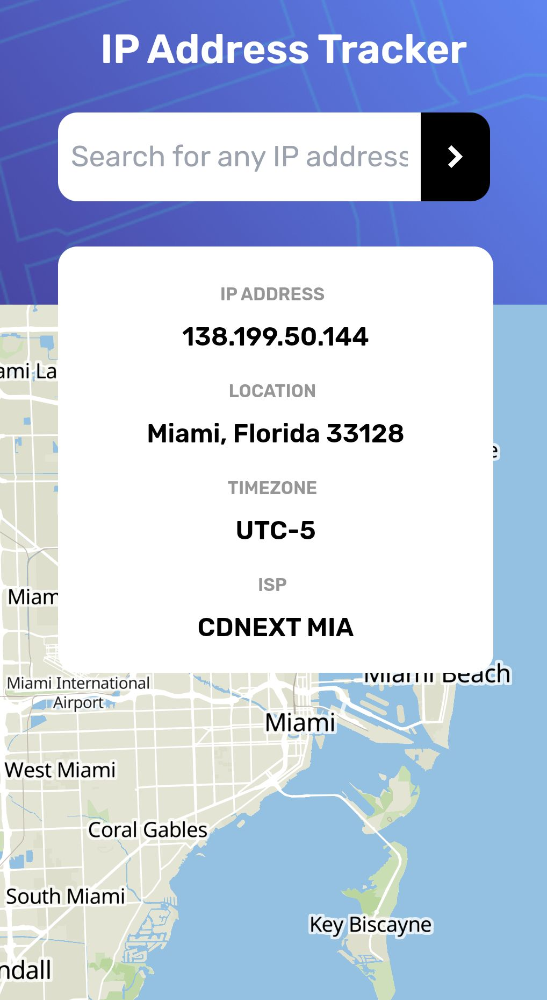

# Description:

This solution for the [Frontend-mentor](https://www.frontendmentor.io/challenges/ip-address-tracker-I8-0yYAH0) challenge uses [Maplibre](https://maplibre.org/) to create maps instead of [Leaflet](https://leafletjs.com/), along with [Ipgeolocation](https://ipgeolocation.io/) in place of [Ipify](https://www.ipify.org/). The frameworks used are [Tailwindcss](https://tailwindcss.com/) and [Vue.js](https://vuejs.org/).

